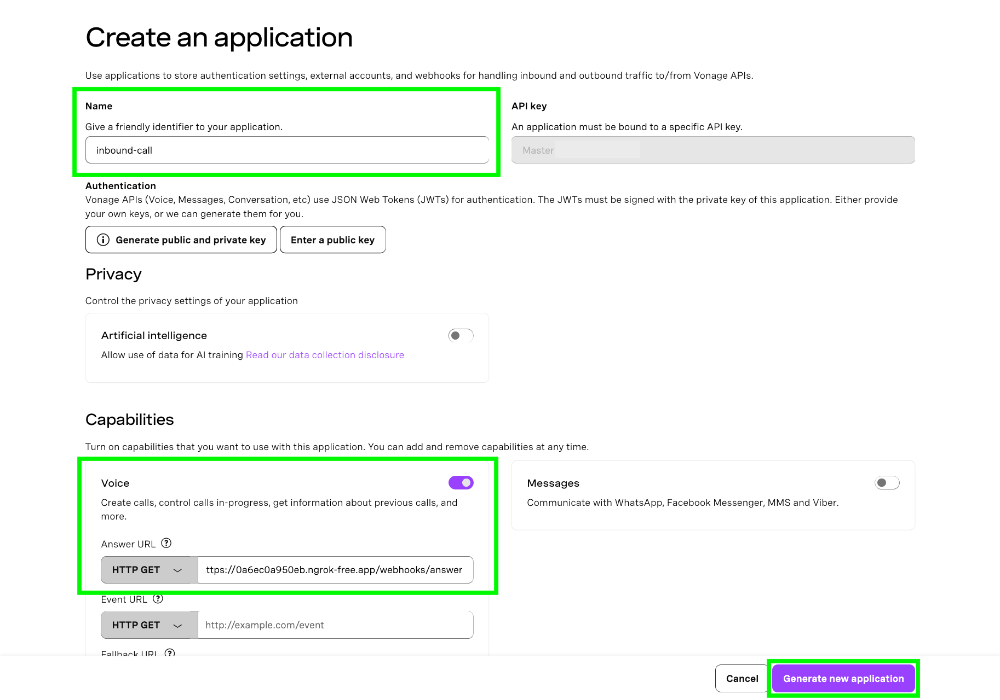
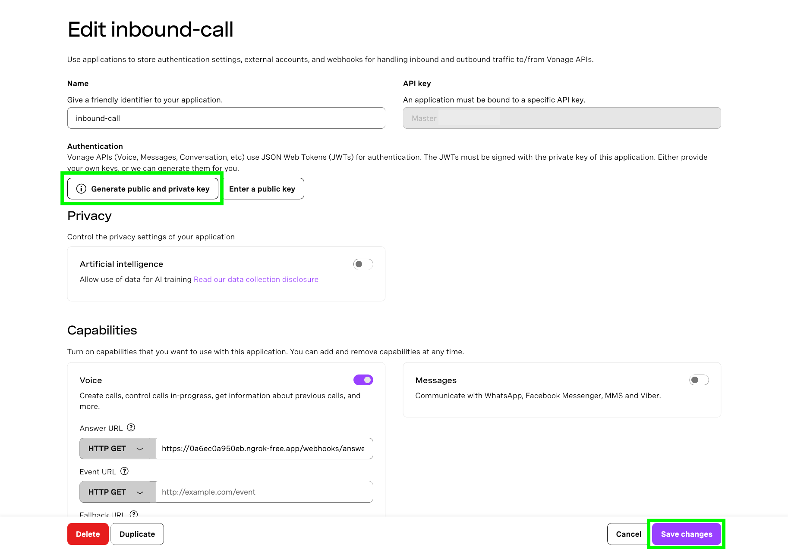
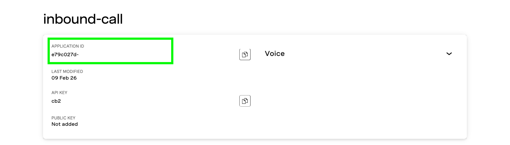

# Handle an Inbound Phone Call with Python

This repo uses the [Vonage Voice API](https://developer.vonage.com/en/voice/voice-api/overview) and FastAPI to handle an inbound call three different ways:
1. Playing a Text-To-Speech Message
2. Connecting a Caller to an Agent
3. Playing Hold Music

# How To Get This Code Running

## Prerequsites
- Python 3.8+
- A [Vonage API account](https://ui.idp.vonage.com/ui/auth/registration)
- An [ngrok account and installation](https://developer.vonage.com/en/blog/local-development-nexmo-ngrok-tunnel-dr/)
- An additional phone number to act as the “agent” to connect to

## Setup

### Create an account with ngrok and install it
The Voice API must be able to access your webhook so that it can make requests to it, therefore, the endpoint URL must be accessible over the public internet.

In order to do that for this tutorial, we will use [ngrok](https://ngrok.com/). Check out our [ngrok tutorial](https://developer.vonage.com/en/blog/local-development-nexmo-ngrok-tunnel-dr/) to learn how to install and use it.

### Spin up an ngrok tunnel

In a separate terminal window, run:

```
ngrok http 3000
```

This command will generate the public URLs your local server will tunnel to on port 3000. Take note of the public URL – it should look something like this:

```bash
Forwarding                	https://some-public-url.ngrok-free.app -> http://localhost:3000
```

### Create a Vonage account and purchase a number

You will need a [Vonage API account](https://ui.idp.vonage.com/ui/auth/registration) and a virtual phone number. You can purchase a number from the [developer dashboard](https://dashboard.vonage.com/numbers/buy-numbers). Make sure to buy a number in your country code and with the appropriate features.

### Create a Voice API application and link your number to it

Create your Voice API application in the [developer dashboard](https://dashboard.vonage.com/applications) by navigating to the **Applications** window from the left hand menu and clicking the “Create new application” button. This will open the application creation menu. Give your application the name `inbound-call`.

Under the Capabilities section, toggle the option for **Voice**, which will reveal a list of text fields. In the text field labeled **Answer URL**, provide the ngrok public URL amended with the webhook defined in the FastAPI app. This will look something like: `https://some-public-url.ngrok-free.app/webhooks/answer`.

Click the “Generate new application” button.



Now that your application has been created, you can link your number to it by clicking on the **Link** button in the table of available numbers. Your application is now ready to answer inbound calls. The scenarios we will code tell the application what to do when the `/answer` webhook is called.

## Run the code

### 1. Create and activate a Python virtual environment

```
python3 -m venv venv && source venv/bin/activate
```
### 2. Install dependencies
```
pip install -r requirements.txt
```
### 3. Generate and add your application ID and private key to your environment variables

In the developer dashboard [Applications menu](https://dashboard.vonage.com/applications), click on the `inbound-call` application and then click **Edit**. Once the edit window opens, click on the button that says, “Generate public and private key”. This will trigger a download of your private key as a file with the extension `.key`. **Keep this file private and do not share it anywhere it could be compromised.**

Click on the "Save changes button" and also note your Application ID.





Move your private key file to your project directory and update the `.env_template` file with your application ID. Then update the name of the file to `.env`.

### Scenario 1: Playing a Text-To-Speech Message

In this particular scenario, we will respond to an inbound call to a virtual number by playing a text-to-speech message.

#### 1. Run the app

To spin up the app, run the following:

```
fastapi dev --port 3000 scenario-1.py
```

#### 2. Try it out!

Call the virtual number you linked to the application in the dashboard. If everything is working correctly, you should be greeted with the text-to-speech message you defined in your Python code.

### Scenario 2: Connecting a Caller to an Agent

In this scenario, we will include the [NCCO action](https://developer.vonage.com/en/voice/voice-api/ncco-reference?lang=synchronous#ncco-actions) `Connect` which will connect the caller to an agent after completing the `Talk` action.

#### 1. Run the app

To spin up the app, run the following:

```
fastapi dev --port 3000 scenario-2.py
```

#### 2. Try it out!

To try out this particular scenario, you will need two phone numbers: One to call the virtual number with and another phone number to connect to. Dial your Vonage virtual number and if everything has been implemented correctly, you should be greeted with the text-to-speech message and then your second number (the agent number) should ring.

### Scenario 3: Playing Hold Music

In this scenario, we handle an inbound call by placing the caller on hold and playing music until an agent is available. Then the call is transferred to the agent.

This is the call flow we will implement:
1. When the call is answered, the caller will hear a text-to-speech message
2. The caller will be placed on hold and music will be streamed to them
3. After a simulated 30 seconds time delay, the call will be forwarded to a second NCCO
4. The second NCCO plays a text-to-speech message and connects the caller to an agent

#### 1. Run the app

To spin up the app, run the following:

```
fastapi dev --port 3000 scenario-3.py
```

#### 2. Try it out!

To try out this particular scenario, you will need two phone numbers: One to call the virtual number with and another phone number to connect to. Dial your Vonage virtual number and if everything has been implemented correctly, you should be greeted with the text-to-speech message followed by hold music. After 30 seconds, the call will be transferred to the agent number you provided.